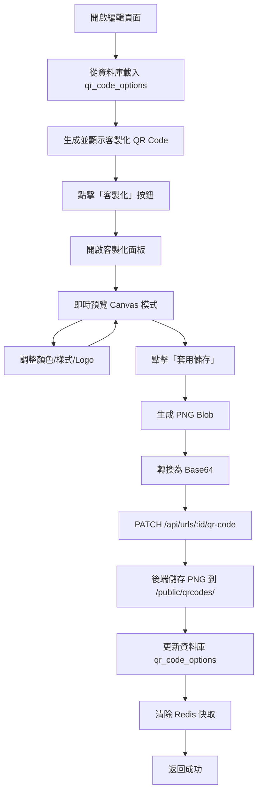

# CLAUDE.md

This file provides guidance to Claude Code (claude.ai/code) when working with code in this repository.

# Short URL API - 慈濟短網址系統

## 快速開始

```bash
# 安裝依賴
npm install

# 開發模式（使用 tsx 直接執行 TypeScript）
npm run dev

# 開發模式（檔案變更自動重啟）
npm run dev:watch

# 編譯 TypeScript 到 dist/
npm run build

# 正式環境執行（需先 build）
npm start

# 使用 PM2 叢集模式部署
pm2 start ecosystem.config.cjs
```

## 專案概述

這是一個為慈濟基金會設計的企業級短網址管理系統，提供完整的短網址生成、管理、分析和客製化 QR Code 功能。

### 核心功能

- ✅ 短網址生成與管理
- ✅ 客製化 QR Code（顏色、樣式、Logo）
- ✅ 即時訪問統計分析
- ✅ 密碼保護短網址
- ✅ 過期時間設定
- ✅ Redis 快取優化
- ✅ 完整的 REST API

## 技術架構

### 後端技術棧

```
┌─────────────────────────────────────────┐
│           Fastify (v5.6.2)              │  HTTP Server
├─────────────────────────────────────────┤
│     TypeScript + Node.js (ESM)          │  Runtime
├─────────────────────────────────────────┤
│   Supabase (PostgreSQL + Auth)          │  Database
├─────────────────────────────────────────┤
│         Redis (ioredis)                 │  Cache
├─────────────────────────────────────────┤
│      bcrypt + pino-pretty               │  Security & Logging
└─────────────────────────────────────────┘
```

### 關鍵架構決策：Supabase 雙客戶端模式

專案使用兩種 Supabase 客戶端來處理不同場景：

```typescript
// 1. Service Client（繞過 RLS）
// 用於：短網址重定向、記錄點擊統計、系統級操作
import { supabase } from './services/supabase.js'

// 2. User Client（遵守 RLS）
// 用於：使用者的 CRUD 操作，自動過濾只顯示該使用者的資料
const userClient = createUserClient(accessToken)
```

**重要**：所有需要驗證使用者身份的 API 都應使用 `createUserClient(token)`，讓 Supabase RLS 自動處理權限控制。

### 前端技術棧

```
┌─────────────────────────────────────────┐
│         Vanilla JavaScript              │  Core
├─────────────────────────────────────────┤
│         Tailwind CSS                    │  Styling
├─────────────────────────────────────────┤
│       QRCodeStyling (Canvas)            │  QR Code Generation
├─────────────────────────────────────────┤
│          Chart.js                       │  Analytics Visualization
└─────────────────────────────────────────┘
```

### 資料庫架構

#### 主要資料表：`urls`

```sql
CREATE TABLE urls (
  id UUID PRIMARY KEY DEFAULT uuid_generate_v4(),
  short_code VARCHAR(50) UNIQUE NOT NULL,
  original_url TEXT NOT NULL,

  -- 密碼保護
  password_protected BOOLEAN DEFAULT FALSE,
  password_hash TEXT,

  -- 過期設定
  expires_at TIMESTAMP WITH TIME ZONE,

  -- QR Code 配置
  qr_code_options JSONB,              -- 客製化配置
  qr_code_path TEXT,                  -- PNG 檔案路徑
  qr_code_generated BOOLEAN DEFAULT FALSE,

  -- 狀態
  is_active BOOLEAN DEFAULT TRUE,

  -- 時間戳記
  created_at TIMESTAMP WITH TIME ZONE DEFAULT NOW(),
  updated_at TIMESTAMP WITH TIME ZONE DEFAULT NOW()
);
```

#### 點擊記錄表：`url_clicks`

```sql
CREATE TABLE url_clicks (
  id UUID PRIMARY KEY DEFAULT uuid_generate_v4(),
  url_id UUID REFERENCES urls(id),
  click_type VARCHAR(20),              -- 'link' 或 'qr'
  clicked_at TIMESTAMP WITH TIME ZONE DEFAULT NOW()
);
```

#### 統計視圖

- `url_total_stats` - 總計統計（即時）
- `url_daily_stats` - 每日統計（即時）

## QR Code 客製化功能

### 配置資料結構

```typescript
interface QRCodeOptions {
  // 顏色設定
  dotsColor: string        // QR Code 主體顏色 (hex)
  bgColor: string          // 背景顏色 (hex)
  bgOpacity: number        // 背景透明度 (0-100)

  // 樣式設定
  dotsType: string         // Dots 樣式類型
  cornersSquareType: string // 定位點外框樣式
  cornersDotType: string    // 定位點內部樣式

  // Logo 設定
  showLogo: boolean        // 是否顯示慈濟 Logo
}
```

### Dots 樣式選項

- `square` - 方形
- `rounded` - 圓角
- `extra-rounded` - 超圓角
- `dots` - 圓點
- `classy` - 優雅
- `classy-rounded` - 優雅圓角

### 定位點樣式選項

**外框 (cornersSquareType)**:
- `square` - 方形
- `dot` - 圓點
- `extra-rounded` - 超圓角

**內部 (cornersDotType)**:
- `square` - 方形
- `dot` - 圓點
- `rounded` - 圓角

### 客製化流程



## API 端點

### 短網址管理

#### 創建短網址
```http
POST /api/urls
Content-Type: application/json

{
  "original_url": "https://example.com/very-long-url",
  "short_code": "custom",           // 選填：自訂短代碼
  "expires_at": "2024-12-31T23:59:59Z"  // 選填：過期時間
}
```

#### 獲取短網址列表
```http
GET /api/urls?page=1&limit=10
```

#### 獲取單個短網址
```http
GET /api/urls/:id
```

#### 更新短網址
```http
PUT /api/urls/:id
Content-Type: application/json

{
  "original_url": "https://new-url.com",
  "password_protected": true,
  "password": "secret123",
  "expires_at": "2024-12-31T23:59:59Z"
}
```

#### 刪除（停用）短網址
```http
DELETE /api/urls/:id
```

### QR Code 管理

#### 更新 QR Code 配置
```http
PATCH /api/urls/:id/qr-code
Content-Type: application/json

{
  "qr_code_options": {
    "dotsColor": "#713d3d",
    "bgColor": "#ffffff",
    "bgOpacity": 100,
    "dotsType": "rounded",
    "cornersSquareType": "square",
    "cornersDotType": "square",
    "showLogo": true
  },
  "qr_code_data_url": "data:image/png;base64,..."
}
```

### 統計分析

#### 獲取統計資料
```http
GET /api/urls/:id/stats?days=30
```

回應格式：
```json
{
  "total": {
    "total_clicks": 150,
    "link_clicks": 100,
    "qr_scans": 50,
    "last_clicked_at": "2024-01-15T10:30:00Z"
  },
  "daily": [
    {
      "date": "2024-01-15",
      "total_clicks": 25,
      "link_clicks": 15,
      "qr_scans": 10
    }
  ]
}
```

### 短網址重定向

#### 訪問短網址
```http
GET /s/:shortCode
```

行為：
- 如果有密碼保護 → 顯示密碼輸入頁面
- 如果已過期 → 顯示過期訊息頁面
- 否則 → 重定向到原始 URL 並記錄點擊（類型：'link'）

#### QR Code 掃描追蹤
```http
GET /s/:shortCode/qr
```

行為：同上，但記錄點擊類型為 'qr'

## 專案結構

```
shorturl-api/
├── src/
│   ├── index.ts                    # 應用程式入口
│   ├── routes/
│   │   └── urls.ts                 # URL 路由與邏輯
│   ├── services/
│   │   ├── supabase.ts             # Supabase 客戶端
│   │   └── redis.ts                # Redis 客戶端與快取鍵
│   ├── utils/
│   │   ├── shortcode.ts            # 短代碼生成與驗證
│   │   ├── qrcode.ts               # QR Code 生成工具（未使用）
│   │   └── html-templates.ts       # HTML 模板（密碼頁面、過期頁面）
│   └── types/
│       └── index.ts                # TypeScript 類型定義
│
├── public/                         # 靜態文件
│   ├── index.html                  # 首頁
│   ├── links.html                  # 連結管理頁面
│   ├── edit.html                   # 編輯頁面
│   ├── analytics.html              # 分析頁面
│   ├── js/
│   │   ├── api.js                  # API 封裝
│   │   ├── index.js                # 首頁邏輯
│   │   ├── links.js                # 連結管理邏輯
│   │   ├── edit.js                 # 編輯邏輯（含 QR 客製化）
│   │   └── analytics.js            # 分析邏輯
│   ├── images/
│   │   ├── tzuchi-logo.svg         # 慈濟 Logo (SVG)
│   │   └── tzuchi-logo.png         # 慈濟 Logo (PNG)
│   └── qrcodes/                    # QR Code PNG 儲存目錄
│       └── {shortCode}.png
│
├── dist/                           # 編譯後的 JavaScript
├── .env                            # 環境變數
├── package.json
├── tsconfig.json
└── CLAUDE.md                       # 本文件
```

## 環境變數配置

```env
# Server
PORT=8080
BASE_URL=https://url.tzuchi.org

# Supabase
SUPABASE_URL=https://xxx.supabase.co
SUPABASE_ANON_KEY=eyJxxx...
SUPABASE_SERVICE_ROLE_KEY=eyJxxx...

# Redis
REDIS_HOST=localhost
REDIS_PORT=6379
REDIS_PASSWORD=

# Short Code
SHORT_CODE_LENGTH=6
```

## 快取策略

### Redis 快取鍵設計

```typescript
CACHE_KEYS = {
  URL: (shortCode: string) => `url:${shortCode}`,
  URL_LIST: (page: number, limit: number) => `urls:list:${page}:${limit}`,
  URL_STATS: (urlId: string, days: number) => `url:stats:${urlId}:${days}`
}

CACHE_TTL = {
  URL: 3600,           // 1 小時
  URL_LIST: 300,       // 5 分鐘
  URL_STATS: 300       // 5 分鐘
}
```

### 快取失效策略

- **創建短網址** → 清除 `urls:list:*`
- **更新短網址** → 清除 `url:{shortCode}` 和 `urls:list:*`
- **刪除短網址** → 清除 `url:{shortCode}` 和 `urls:list:*`
- **更新 QR Code** → 清除 `url:{shortCode}`

## 關鍵問題與解決方案

### 問題 1: QR Code 配置欄位名稱不符

**問題描述**：
資料庫欄位是 `qr_code_options`（複數），但程式碼使用 `qr_code_option`（單數），導致 500 錯誤。

**錯誤訊息**：
```
Could not find the 'qr_code_option' column of 'urls' in the schema cache
```

**解決方案**：
1. 使用 MCP 工具查詢資料庫 schema
2. 統一修改前端和後端使用 `qr_code_options`
3. 移除 `JSON.stringify()` 和 `JSON.parse()`（因為 JSONB 自動處理）

**修改位置**：
- `src/routes/urls.ts:266-358` - 後端 API
- `public/js/edit.js:152-158` - 前端讀取
- `public/js/edit.js:1237` - 前端儲存

### 問題 2: 即時預覽不更新樣式變化

**問題描述**：
調整 Dots 樣式、定位點樣式時，即時預覽沒有反應。顏色和 Logo 的即時預覽正常。

**根本原因**：
1. QRCodeStyling 的 `update()` 方法不可靠
2. SVG 模式有渲染快取問題

**解決方案**：
1. 改用 **Canvas 模式**而不是 SVG 模式
2. 每次都完全清空容器並重新創建實例
3. 添加強制重繪和延遲渲染

**程式碼**：
```javascript
// 改用 Canvas 模式
const config = {
  type: "canvas",  // 原本是 "svg"
  // ...
}

// 完全清空容器
previewCanvas.innerHTML = ''
previewCanvas.textContent = ''
while (previewCanvas.firstChild) {
  previewCanvas.removeChild(previewCanvas.firstChild)
}

// 強制重繪
void previewCanvas.offsetHeight

// 延遲渲染
setTimeout(() => {
  previewQRInstance.append(previewCanvas)
}, 0)
```

### 問題 3: 瀏覽器快取導致資料不同步

**問題描述**：
API 返回正確的 `qr_code_options`，但前端顯示 `null`。

**根本原因**：
瀏覽器快取了舊的 API 回應。

**解決方案**：
添加時間戳記參數和多重快取控制 header：

```javascript
const timestamp = Date.now()
const response = await fetch(`/api/urls/${currentUrlId}?_=${timestamp}`, {
  cache: 'no-store',
  headers: {
    'Cache-Control': 'no-cache',
    'Pragma': 'no-cache'
  }
})
```

### 問題 4: 客製化面板無法顯示已保存配置

**問題描述**：
重新載入頁面後，開啟客製化面板顯示預設配置而非已保存的配置。

**根本原因**：
`currentQRConfig` 是內存變數，頁面重新載入後會重置為 `undefined`。

**解決方案**：
在 `openClientCustomizeModal()` 中從 `currentUrlData.qr_code_options` 重建配置：

```javascript
function openClientCustomizeModal() {
  let currentConfig

  // 優先從 currentQRConfig 讀取
  if (currentQRConfig) {
    currentConfig = currentQRConfig
  }
  // 從資料庫配置重建
  else if (currentUrlData?.qr_code_options) {
    const saved = currentUrlData.qr_code_options
    currentConfig = {
      width: 300,
      height: 300,
      type: "svg",
      data: `${window.location.origin}/s/${currentUrlData.short_code}`,
      dotsOptions: {
        color: saved.dotsColor || '#000000',
        type: saved.dotsType || 'rounded'
      },
      // ... 其他配置
    }
  }
  // 使用預設配置
  else {
    currentConfig = { ...QR_CONFIG, data: `...` }
  }
}
```

### 問題 5: TypeScript 編譯錯誤

**問題描述**：
```
error TS2307: Cannot find module 'canvas' or its corresponding type declarations
```

**根本原因**：
`src/utils/qrcode.ts` 嘗試載入 server-side QR Code 生成的依賴，但專案改用 client-side 生成。

**解決方案**：
註解掉未使用的 import：

```typescript
// DISABLED: canvas and jsdom dependencies (not needed for client-side generation)
// nodeCanvas = (await import('canvas')).default
// const jsdomModule = await import('jsdom')
// JSDOM = jsdomModule.JSDOM
```

## 效能優化

### 1. Redis 快取層

- 短網址重定向使用快取，減少資料庫查詢
- 列表和統計資料快取 5 分鐘
- 單一 URL 資料快取 1 小時

### 2. 資料庫優化

- 使用 View 進行即時統計聚合
- 在 `short_code` 上建立唯一索引
- 在 `url_clicks.url_id` 和 `url_clicks.clicked_at` 上建立索引

### 3. 前端優化

- 客戶端 QR Code 生成（避免 server 負載）
- Canvas 模式渲染（比 SVG 快）
- 時間戳記快取破壞（確保最新資料）

## 安全性考量

### 1. 密碼保護

- 使用 bcrypt hash（saltRounds: 10）
- 密碼驗證失敗不透露詳細資訊
- 支援停用密碼保護並清除 hash

### 2. 輸入驗證

- 短代碼格式驗證（字母、數字、連字號）
- URL 格式驗證
- XSS 防護（HTML 轉義）

### 3. CORS 設定

```typescript
fastify.register(cors, {
  origin: true,
  credentials: true
})
```

## 部署指南

### 1. 安裝依賴

```bash
npm install
```

### 2. 設定環境變數

```bash
cp .env.example .env
# 編輯 .env 填入正確的值
```

### 3. 建置專案

```bash
npm run build
```

### 4. 啟動服務

```bash
npm start
```

### 5. 開發模式

```bash
npm run dev          # 一般開發模式
npm run dev:watch    # 監聽檔案變更自動重啟
```

## 資料庫設定

### 1. 建立資料表

參考 `src/routes/urls.ts` 中的資料表結構或使用 Supabase Dashboard 建立。

### 2. 建立統計視圖

```sql
-- 總計統計視圖
CREATE VIEW url_total_stats AS
SELECT
  u.id,
  u.short_code,
  u.original_url,
  u.is_active,
  u.created_at,
  COUNT(c.id) as total_clicks,
  COUNT(CASE WHEN c.click_type = 'link' THEN 1 END) as link_clicks,
  COUNT(CASE WHEN c.click_type = 'qr' THEN 1 END) as qr_scans,
  MAX(c.clicked_at) as last_clicked_at
FROM urls u
LEFT JOIN url_clicks c ON u.id = c.url_id
GROUP BY u.id;

-- 每日統計視圖
CREATE VIEW url_daily_stats AS
SELECT
  u.id as url_id,
  DATE(c.clicked_at) as date,
  COUNT(*) as total_clicks,
  COUNT(CASE WHEN c.click_type = 'link' THEN 1 END) as link_clicks,
  COUNT(CASE WHEN c.click_type = 'qr' THEN 1 END) as qr_scans
FROM urls u
LEFT JOIN url_clicks c ON u.id = c.url_id
GROUP BY u.id, DATE(c.clicked_at);
```

## 監控與日誌

### Pino Logger 配置

```typescript
const logger = {
  transport: {
    target: 'pino-pretty',
    options: {
      translateTime: 'HH:MM:ss Z',
      ignore: 'pid,hostname'
    }
  }
}
```

### 日誌格式

```
[14:50:55 UTC] INFO: Server listening at http://127.0.0.1:8080
[14:50:55 UTC] INFO: 🚀 Server is running on http://0.0.0.0:8080
[14:50:55 UTC] INFO: 📝 API Documentation: http://0.0.0.0:8080/
[14:50:55 UTC] INFO: 🔗 Short URL format: http://0.0.0.0:8080/s/{code}
```

## 測試

### 手動測試流程

1. **創建短網址**
   - 訪問首頁
   - 輸入長網址
   - 點擊生成
   - 驗證短網址和 QR Code

2. **客製化 QR Code**
   - 進入編輯頁面
   - 點擊「客製化」
   - 調整顏色、樣式、Logo
   - 驗證即時預覽
   - 點擊「套用儲存」
   - 重新整理頁面驗證持久化

3. **密碼保護**
   - 設定密碼
   - 訪問短網址
   - 驗證密碼頁面
   - 輸入正確密碼
   - 驗證重定向

4. **過期時間**
   - 設定未來時間（正常訪問）
   - 設定過去時間（顯示過期頁面）

5. **統計追蹤**
   - 多次訪問短網址
   - 掃描 QR Code
   - 檢查統計頁面
   - 驗證點擊類型區分

## 未來改進方向

### 短期（1-2 週）

- [ ] 添加單元測試和整合測試
- [ ] 實作 API rate limiting
- [ ] 添加批量操作功能
- [ ] 實作短網址匯出功能（CSV/Excel）

### 中期（1-2 月）

- [ ] 添加使用者認證與權限管理
- [ ] 實作短網址資料夾分類
- [ ] 添加標籤系統
- [ ] 實作更詳細的分析報表（地理位置、裝置類型）

### 長期（3-6 月）

- [ ] 實作 A/B 測試功能
- [ ] 添加 Webhook 通知
- [ ] 實作 API key 管理
- [ ] 建立管理後台（Dashboard）

## 技術債務

1. **測試覆蓋率不足** - 目前沒有自動化測試
2. **錯誤處理** - 需要更細緻的錯誤處理和使用者友善的錯誤訊息
3. **型別安全** - 前端 JavaScript 可考慮遷移到 TypeScript
4. **文件生成** - 考慮使用 Swagger/OpenAPI 自動生成 API 文件

## 貢獻者

- Claude (Anthropic) - AI 輔助開發
- 慈濟基金會團隊 - 需求規劃與測試

## 授權

內部專案，版權所有 © 2024 慈濟基金會

---

**最後更新**: 2024-01-20
**版本**: 1.0.0
**維護者**: Claude Code Team
